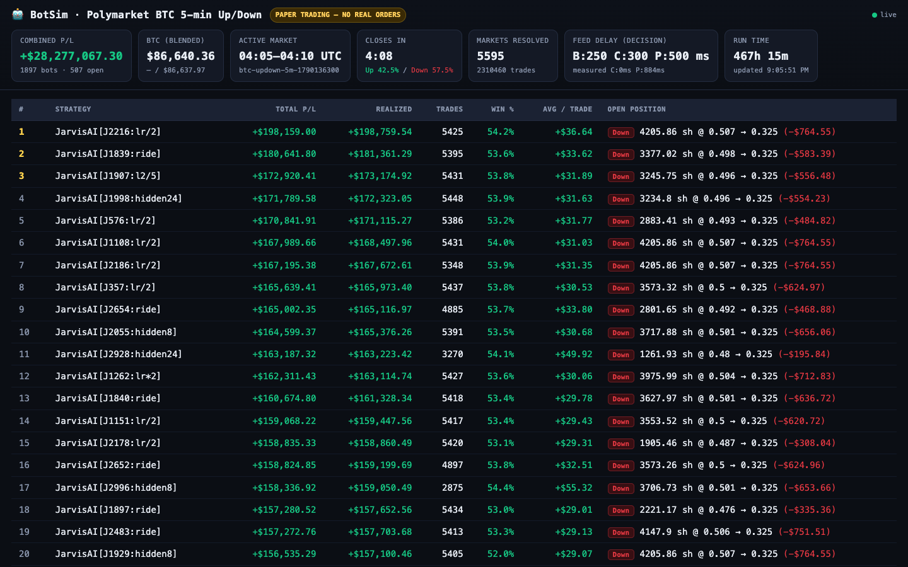

# BotSim

A live market simulator and machine-learning experiment for Polymarket's 5-minute "Bitcoin Up or Down" markets.

> **Paper trading only.** BotSim reads public market data and books hypothetical trades. It never signs, sends or authenticates a real order.



*The live leaderboard, in paper money. Each bot starts with $1,000 of simulated cash, and the combined total adds up 1,897 bots all "filling" against the same order books, which no real market would allow. Treat these numbers as a simulation, not profit.*

## The question

Every five minutes, Polymarket opens a new market: will Bitcoin close higher or lower than it opened? I wanted to find out whether any systematic strategy can beat these markets once you account for everything that makes real trading hard: fees, the bid/ask spread, slippage, and the fraction of a second it takes data to reach you and your order to reach the market.

## How it works

1. **Collectors** record live data around the clock: Polymarket order books, trades and settlements; BTC prices from Coinbase, Kraken, Bybit and OKX; the Chainlink price feed these markets actually settle on; plus news-headline sentiment, large on-chain "whale" transfers and the Fear & Greed index.
2. **A realistic fill model.** Simulated orders walk the real order book level by level, pay a tick of slippage plus the venue's actual taker fee, and only see data after a configurable delay, so bots can't trade on information they wouldn't have had yet.
3. **Jarvis, a self-improving learner.** An online neural network reads 24 signals and updates its weights after every settled market. It also runs controlled experiments on itself: it spawns "twins" that each change one setting (learn faster, a bigger network, demand more edge), races each twin against its parent on the same live markets, and only adopts a change when the difference is statistically significant (|z| ≥ 2 on three consecutive daily checks). Every birth, verdict and promotion is logged.
4. **Dashboards.** A live leaderboard (Server-Sent Events, refreshes on every trade) and a HUD show it all in real time.

## What I found

Before Jarvis, I ran generations of hand-written strategy "families", 100+ bots at a time, and wrote the results up in [PAPER.md](PAPER.md). The short version:

- **Naive strategies lose to friction and latency.** On an efficient 5-minute market, the spread, fees and delay eat almost every simple idea.
- **Realism changes everything.** When I added order latency, real fees and book-walking fills, then re-ran the best roster on three weeks of recorded data, a lineup that had shown +$29,000 in paper profit lost $23,000. Most of the old profit was missing friction.
- **Most "winners" were luck.** Directional strategies won or lost with the market's trend, and one strategy that passed every in-sample test lost its whole $1,000 bankroll on data it had never seen. That's why every result has to beat simple controls (always-Up, always-Down, random) on held-out data.

The notes in [`BTC Bot/`](BTC%20Bot/) record every strategy: what it bet on, how it did, and why it died.

## Run it

No dependencies, just Node.js 20+.

```bash
npm start            # collectors + simulator + leaderboard at http://localhost:8088
npm run hud          # Jarvis HUD at http://localhost:4777
npm run collectors   # record data only
npm run report       # print the latest saved results
```

Every setting (starting cash, risk caps, feed delays, fees, ports) lives in [`config.js`](config.js).

## Layout

```
config.js              all settings
src/collectors/        live feeds -> data/*.jsonl
src/feed/              delay queue + unified market state
src/engine/            accounts, fill model, simulator
src/live/jarvis/       the online learner and its experiment lineage
src/signals/           news sentiment and signal aggregation
src/leaderboard/       SSE server + dashboard
src/persistence/       snapshots, trade log, reports
hud/                   Jarvis HUD
```

`src/live/` also holds a live-trading switch that is deliberately an inert scaffold: armed or not, it only writes dry-run lines and never touches a key or the network.

## How I built it

I built BotSim with [Claude Code](https://claude.com/claude-code) as my coding partner. I came up with the questions and the experiment design, including the parent-vs-twin rule Jarvis uses to improve itself, decided what to keep and what to kill after each run, and kept it running. Claude wrote most of the code, and for a while an AI "evolver" even wrote new strategy families on its own each night (see `src/engine/strategies.gen.js`). The write-ups in PAPER.md and the strategy notes came out of those sessions.
